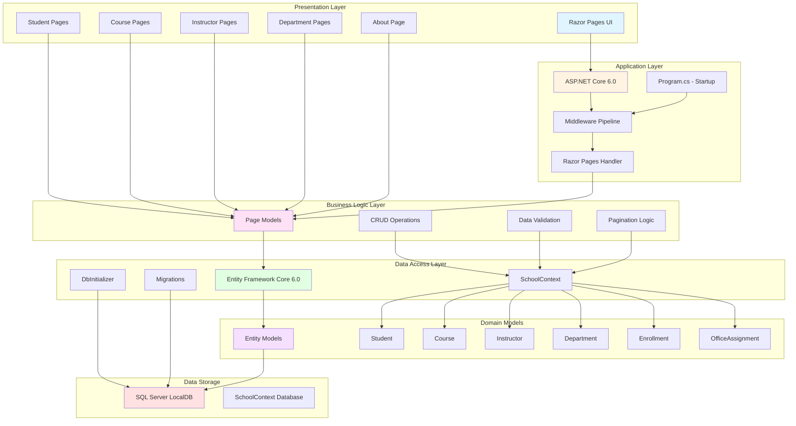

# ContosoUniversity Architecture Diagram

This diagram illustrates the high-level architecture of the ContosoUniversity application based on the assessment results.

## Application Architecture



## Architecture Overview

### Technology Stack

- **Framework**: ASP.NET Core 6.0
- **UI Pattern**: Razor Pages
- **ORM**: Entity Framework Core 6.0
- **Database**: SQL Server LocalDB
- **Target Framework**: .NET 6.0

### Application Layers

#### 1. Presentation Layer
- **Razor Pages**: Server-side rendered web pages
- **Pages**: Students, Courses, Instructors, Departments, About
- **Static Files**: CSS, JavaScript, images served from wwwroot

#### 2. Application Layer
- **ASP.NET Core Pipeline**: Request/response processing
- **Middleware**: HTTPS redirection, static files, routing, authorization
- **Configuration**: appsettings.json for app settings and connection strings

#### 3. Business Logic Layer
- **Page Models**: Code-behind for Razor Pages
- **Operations**: CRUD (Create, Read, Update, Delete) operations
- **Utilities**: Pagination support via PaginatedList class

#### 4. Data Access Layer
- **Entity Framework Core**: ORM for database operations
- **SchoolContext**: DbContext managing database interactions
- **DbInitializer**: Seed data initialization
- **Migrations**: Database schema versioning

#### 5. Domain Models
- **Student**: Student information and enrollments
- **Course**: Course details and relationships
- **Instructor**: Instructor data and office assignments
- **Department**: Department information
- **Enrollment**: Student-course enrollments with grades
- **OfficeAssignment**: Instructor office locations

#### 6. Data Storage
- **SQL Server LocalDB**: Development database
- **Connection String**: Configured in appsettings.json
- **Database Name**: SchoolContext with unique identifier

### Key Features

- **Entity Relationships**: Many-to-many (Course-Instructor), One-to-many (Department-Course, Instructor-Course, Student-Enrollment)
- **Data Seeding**: Automatic database initialization with sample data
- **Auto Migrations**: Database automatically migrated on application startup
- **Pagination**: Built-in pagination support for list views
- **Developer Tools**: Database exception filter for development environment

### Database Connection

```
Server: (localdb)\mssqllocaldb
Database: SchoolContext-a8778b0f-1bfd-4d0f-a500-09390a0df97f
Authentication: Windows Integrated (Trusted_Connection=True)
Features: Multiple Active Result Sets enabled
```

## Dependencies

### NuGet Packages

- `Microsoft.AspNetCore.Diagnostics.EntityFrameworkCore` (6.0.2)
- `Microsoft.EntityFrameworkCore.SqlServer` (6.0.2)
- `Microsoft.EntityFrameworkCore.Tools` (6.0.2)
- `Microsoft.VisualStudio.Web.CodeGeneration.Design` (6.0.2)

### Configuration

- **Page Size**: 3 items per page (configurable in appsettings.json)
- **Logging**: Information level for application, Warning for ASP.NET Core
- **HSTS**: Enabled for non-development environments

## Assessment Summary

This application follows a traditional layered architecture pattern with clear separation of concerns:
- Presentation layer handles user interface
- Business logic resides in page models
- Data access abstracted through Entity Framework Core
- Domain models represent business entities
- SQL Server provides data persistence

The application is well-structured for a small-to-medium educational management system, with proper use of ASP.NET Core and Entity Framework Core patterns.
