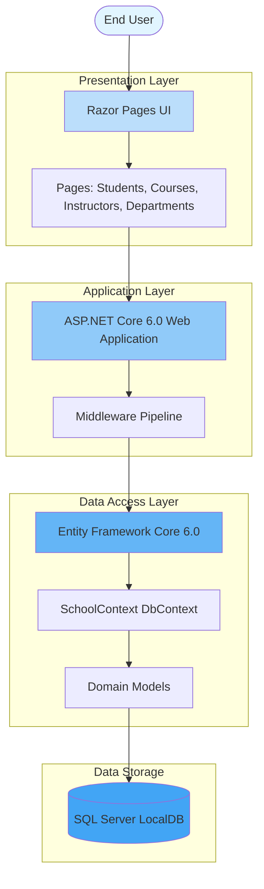

# ContosoUniversity Architecture Diagram

## Application Architecture Overview

This diagram illustrates the high-level architecture of the ContosoUniversity application, showing the key layers, components, and data flow.

## Technology Stack

### Frontend
- **Framework**: ASP.NET Core Razor Pages
- **UI Components**: HTML, CSS, JavaScript
- **Static Files**: wwwroot directory

### Backend
- **Framework**: ASP.NET Core 6.0
- **Pattern**: MVC/Razor Pages
- **Language**: C# with .NET 6.0

### Data Access
- **ORM**: Entity Framework Core 6.0
- **Provider**: Microsoft.EntityFrameworkCore.SqlServer
- **Migrations**: EF Core Migrations
- **Database Seeding**: DbInitializer

### Database
- **Type**: SQL Server LocalDB
- **Connection**: SchoolContext with connection string configuration
- **Entities**: Students, Courses, Instructors, Departments, Enrollments, OfficeAssignments

## Key Components

### Domain Models
- **Student**: Student information and enrollments
- **Course**: Course details and relationships
- **Instructor**: Instructor data and office assignments
- **Department**: Department information
- **Enrollment**: Student-Course enrollment relationship
- **OfficeAssignment**: Instructor office assignments

### Data Context
- **SchoolContext**: Main DbContext managing all entities and relationships
- Configured with many-to-many relationships between Courses and Instructors
- Table naming conventions for Course, Student, and Instructor entities

### Configuration
- **appsettings.json**: Application configuration including connection strings
- **ConnectionString**: Points to SQL Server LocalDB instance
- **Logging**: Configured for ASP.NET Core applications

## Data Flow

1. **User Request**: User interacts with Razor Pages UI
2. **Page Processing**: Razor Pages handle GET/POST requests
3. **Business Logic**: Page models execute business logic
4. **Data Access**: Entity Framework Core queries via SchoolContext
5. **Database Operations**: SQL queries executed against SQL Server LocalDB
6. **Response**: Data retrieved and rendered in Razor Pages views

## Architecture Characteristics

- **Pattern**: Layered architecture with clear separation of concerns
- **Data Access**: Repository pattern via Entity Framework Core DbContext
- **UI Pattern**: Server-side rendered Razor Pages
- **Database**: Code-First approach with EF Core Migrations
- **Initialization**: Automatic database migration and seeding on startup
