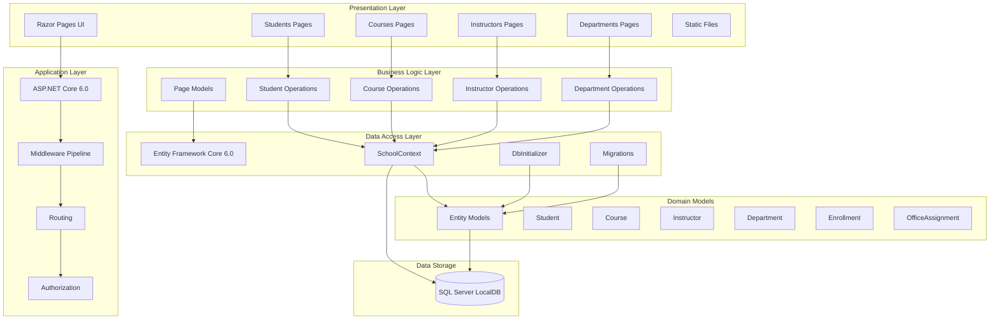

# ContosoUniversity Architecture Diagram

## Application Overview

ContosoUniversity is an ASP.NET Core 6.0 web application built with Razor Pages for managing university data including students, courses, instructors, and departments.

## Architecture Diagram

## Technology Stack

### Framework & Runtime
- **ASP.NET Core**: 6.0
- **Target Framework**: .NET 6.0
- **UI Technology**: Razor Pages

### Data Access
- **ORM**: Entity Framework Core 6.0
- **Database Provider**: Microsoft.EntityFrameworkCore.SqlServer 6.0.2
- **Database**: SQL Server (LocalDB)

### Key Dependencies
- **Microsoft.AspNetCore.Diagnostics.EntityFrameworkCore**: 6.0.2 - Development diagnostics
- **Microsoft.EntityFrameworkCore.Tools**: 6.0.2 - Migration and database tools
- **Microsoft.VisualStudio.Web.CodeGeneration.Design**: 6.0.2 - Code generation support

## Application Layers

### 1. Presentation Layer
- **Razor Pages** for server-side rendering
- Page-specific folders: Students, Courses, Instructors, Departments
- Shared layouts and components
- Static files (CSS, JavaScript, images)

### 2. Application Layer
- ASP.NET Core middleware pipeline
- HTTPS redirection
- Static file serving
- Routing to Razor Pages
- Authorization middleware

### 3. Business Logic Layer
- Page models (*.cshtml.cs files)
- Business logic embedded in page models
- Input validation and processing
- Pagination support (PaginatedList.cs)

### 4. Data Access Layer
- **SchoolContext**: Main DbContext for database operations
- **DbInitializer**: Seeds initial data
- **Migrations**: Schema versioning and updates
- Entity Framework Core for data operations

### 5. Domain Models
Core entity models representing the university domain:
- **Student**: Student information and enrollments
- **Course**: Course details and relationships
- **Instructor**: Instructor information and assigned courses
- **Department**: Department data and administration
- **Enrollment**: Student-Course enrollment relationships
- **OfficeAssignment**: Office locations for instructors

## Data Flow

1. **User Request** → Razor Pages receive HTTP requests
2. **Page Model** → Page model processes the request
3. **Data Access** → SchoolContext queries/updates via EF Core
4. **Database** → SQL Server LocalDB stores and retrieves data
5. **Response** → Data rendered in Razor views and returned to user

## Database Configuration

- **Connection String**: Configured in appsettings.json
- **Database**: SchoolContext database on SQL Server LocalDB
- **Initialization**: Automatic migration and seeding on application startup
- **Development Features**: Database developer page exception filter enabled

## Key Features

- **CRUD Operations**: Full create, read, update, delete for all entities
- **Pagination**: Support for paginated lists (configurable page size)
- **Relationships**: Complex many-to-many relationships (Course-Instructor)
- **Database Migrations**: Automatic schema updates on startup
- **Data Seeding**: Initial data population via DbInitializer
- **Error Handling**: Development and production error pages

## Notes

- Application uses minimal API configuration with top-level statements (Program.cs)
- Implicit usings enabled for cleaner code
- LocalDB suitable for development; production would require SQL Server or Azure SQL
- No separate service layer; business logic in page models follows Razor Pages conventions
