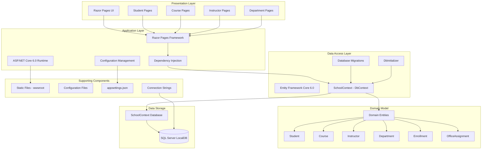

# ContosoUniversity Architecture Diagram

## Application Overview

ContosoUniversity is an ASP.NET Core 6.0 web application built using Razor Pages architecture pattern with Entity Framework Core for data persistence.

## Architecture Diagram

## Technology Stack

### Framework & Runtime
- **ASP.NET Core 6.0** - Web application framework
- **Razor Pages** - Page-based programming model for building web UI
- **.NET 6.0** - Target framework

### Data Access
- **Entity Framework Core 6.0** - Object-relational mapper (ORM)
- **Microsoft.EntityFrameworkCore.SqlServer** (v6.0.2) - SQL Server provider
- **Microsoft.EntityFrameworkCore.Tools** (v6.0.2) - EF Core tooling for migrations

### Database
- **SQL Server LocalDB** - Development database
- Database: SchoolContext
- Connection: Trusted connection with multiple active result sets

### Development Tools
- **Microsoft.AspNetCore.Diagnostics.EntityFrameworkCore** (v6.0.2) - Database error diagnostics
- **Microsoft.VisualStudio.Web.CodeGeneration.Design** (v6.0.2) - Code scaffolding

## Application Layers

### 1. Presentation Layer (Pages/)
- Razor Pages for UI rendering
- Page-specific logic in code-behind files (.cshtml.cs)
- Organized by feature: Students, Courses, Instructors, Departments
- Shared layout and components

### 2. Business/Application Layer (Program.cs)
- Application bootstrapping and configuration
- Service registration (Dependency Injection)
- Middleware pipeline configuration
- Database initialization on startup

### 3. Data Access Layer (Data/)
- **SchoolContext**: EF Core DbContext for database operations
- **DbInitializer**: Seeds initial data into database
- **Migrations**: Database schema version control

### 4. Domain Model (Models/)
- **Student**: Student information and enrollments
- **Course**: Course details and relationships
- **Instructor**: Instructor data and office assignments
- **Department**: Department information
- **Enrollment**: Student course enrollments
- **OfficeAssignment**: Instructor office locations

## Data Flow

1. **User Request** → Razor Page endpoint
2. **Page Handler** → Executes business logic
3. **SchoolContext** → Queries/updates database via EF Core
4. **SQL Server** → Stores and retrieves data
5. **Response** → Renders Razor view with data

## Key Features

- **Database-First Approach**: Uses EF Core migrations for schema management
- **Auto-Migration**: Database automatically migrated on application startup
- **Seed Data**: Initial data populated via DbInitializer
- **Developer Experience**: 
  - Developer exception pages in development mode
  - Database diagnostics enabled
  - HTTPS redirection and static file serving

## Security Considerations

- HSTS (HTTP Strict Transport Security) enabled in production
- HTTPS redirection configured
- Trusted connection to database (Windows Authentication)
- Authorization middleware configured (though not actively used in current implementation)

## Configuration

- **Connection String**: Defined in appsettings.json
- **Page Size**: Configurable pagination (default: 3)
- **Logging**: Configured for Information level with AspNetCore warnings
- **Allowed Hosts**: All hosts allowed (*)
