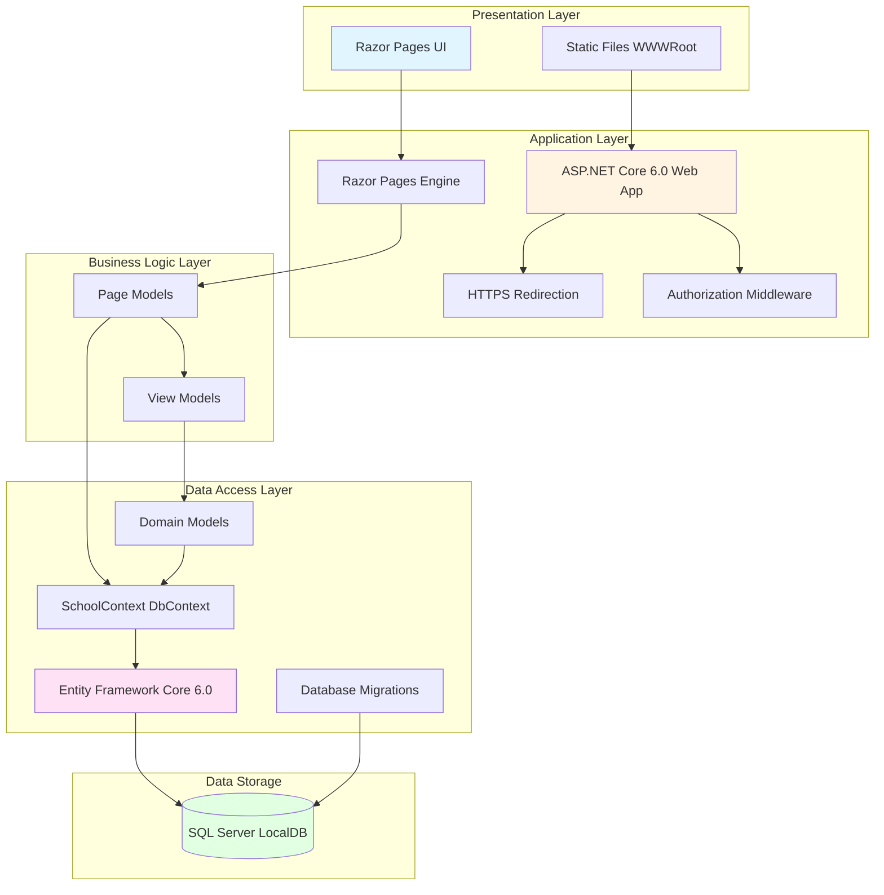

# ContosoUniversity Architecture Diagram

## Application Architecture Overview

This diagram shows the high-level architecture of the ContosoUniversity application, a .NET 6.0 web application built with ASP.NET Core and Entity Framework Core.

## Technology Stack

### Frontend
- **UI Framework**: ASP.NET Core Razor Pages
- **Static Files**: HTML, CSS, JavaScript (served from wwwroot)
- **View Engine**: Razor templating engine

### Backend
- **Runtime**: .NET 6.0
- **Web Framework**: ASP.NET Core 6.0
- **Architecture Pattern**: Razor Pages (MVVM-like pattern)

### Data Access
- **ORM**: Entity Framework Core 6.0
- **Database Provider**: Microsoft.EntityFrameworkCore.SqlServer 6.0.2
- **Migration Strategy**: Code-First with EF Migrations

### Database
- **Database**: SQL Server LocalDB
- **Connection**: Trusted Connection with MultipleActiveResultSets
- **Schema Management**: EF Core Migrations

## Key Components

### Domain Models
- **Student**: Student information and enrollments
- **Course**: Course details and relationships
- **Instructor**: Instructor information and office assignments
- **Department**: Academic departments
- **Enrollment**: Student-Course enrollments
- **OfficeAssignment**: Instructor office locations

### Data Context
- **SchoolContext**: Main EF Core DbContext
  - Manages all entity sets
  - Configures entity relationships
  - Handles database operations

### Application Features
- **Student Management**: CRUD operations for students
- **Course Management**: CRUD operations for courses
- **Instructor Management**: CRUD operations for instructors
- **Department Management**: CRUD operations for departments
- **Enrollment Tracking**: Student course enrollments
- **Pagination**: Built-in pagination support (PageSize: 3)
- **Database Initialization**: Automatic seeding with sample data

## Architecture Characteristics

- **Layered Architecture**: Clear separation of concerns
- **Convention-based Routing**: Razor Pages file-based routing
- **Dependency Injection**: Built-in ASP.NET Core DI container
- **Database Migrations**: Automatic migration on startup
- **Developer Tools**: Database developer exception filter for debugging
- **Security**: HTTPS redirection and HSTS enabled in production
