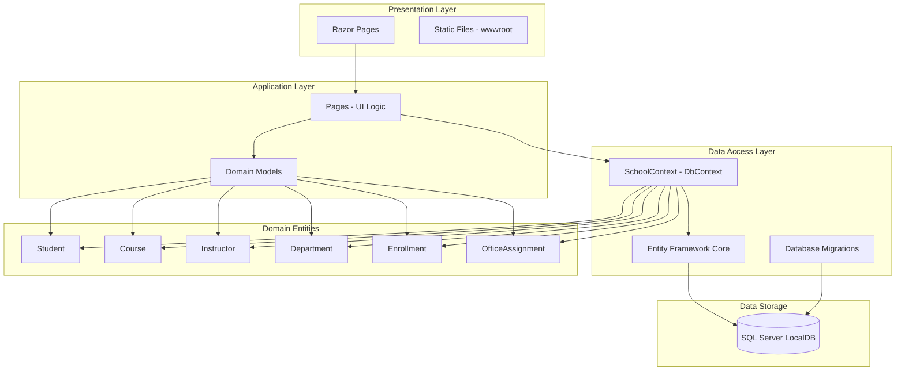

# ContosoUniversity Application Architecture

## Overview
This is an ASP.NET Core 6.0 Razor Pages web application implementing a university management system.

## Architecture Diagram

## Technology Stack

### Framework & Runtime
- **ASP.NET Core 6.0** - Web application framework
- **.NET 6.0** - Runtime platform
- **Razor Pages** - Page-based programming model

### Data Access
- **Entity Framework Core 6.0.2** - ORM framework
- **SQL Server** - Relational database (LocalDB for development)
- **EF Core Migrations** - Database schema management

### Key Dependencies
- `Microsoft.AspNetCore.Diagnostics.EntityFrameworkCore` (6.0.2) - Database error pages
- `Microsoft.EntityFrameworkCore.SqlServer` (6.0.2) - SQL Server provider
- `Microsoft.EntityFrameworkCore.Tools` (6.0.2) - Migration tools
- `Microsoft.VisualStudio.Web.CodeGeneration.Design` (6.0.2) - Code scaffolding

## Application Components

### Presentation Layer
- **Razor Pages**: Server-side page rendering with C# and HTML
- **Static Files**: CSS, JavaScript, images served from wwwroot
- **HTTPS Redirection**: Secure communication enforcement

### Application Layer
- **Page Models**: Handle HTTP requests and business logic
- **Domain Models**: Represent university entities
- **Validation**: Data validation logic

### Data Access Layer
- **SchoolContext**: Central database context managing all entities
- **DbInitializer**: Seeds initial data
- **Migrations**: Manages database schema changes

### Domain Entities
- **Student**: Student records and enrollments
- **Course**: Course definitions and assignments
- **Instructor**: Faculty information and course assignments
- **Department**: Academic departments
- **Enrollment**: Student-course relationships
- **OfficeAssignment**: Instructor office locations

## Data Flow

1. **User Request** → Razor Page endpoint
2. **Page Model** → Processes request, queries data via SchoolContext
3. **SchoolContext** → Uses Entity Framework Core to translate LINQ queries
4. **EF Core** → Executes SQL queries against SQL Server
5. **SQL Server** → Returns data results
6. **Page Model** → Renders Razor view with data
7. **Response** → HTML sent back to user's browser

## Configuration

### Connection Strings
- Uses SQL Server LocalDB for development
- Connection string stored in `appsettings.json`
- Database: `SchoolContext-a8778b0f-1bfd-4d0f-a500-09390a0df97f`

### Application Settings
- Page Size: 3 items per page (pagination)
- HTTPS enabled with HSTS
- Development: Enhanced error pages and migration endpoint
- Production: Error handler and HSTS enforcement

## Architecture Patterns

- **Repository Pattern**: Implemented through Entity Framework Core DbContext
- **Separation of Concerns**: Clear separation between presentation, application, and data layers
- **Convention over Configuration**: ASP.NET Core conventions for routing and page discovery
- **Dependency Injection**: Built-in DI container for service management
